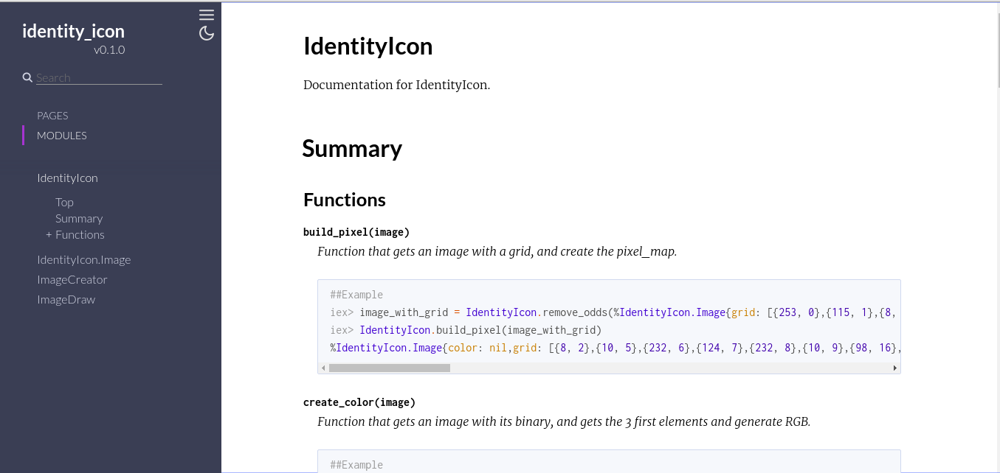

# IdentityIcon

**An application to generate images from any string**

## To run

To run this application you only need to have `Elixir` installed in your machine.

First of all you should install the dependencies:

```shell
mix deps.get
```
Once dependencies installed, you can generate the documentation:

```shell
mix docs
```

Then you can run tests:

```shell
mix test
```

And finnaly you can start the `REPL`:

```shell
iex -S mix
```

## How to generate the image

Inside the `REPL` you only need to run:

```elixir
iex> IdentityIcon.generate_image_from("string")
:ok
```

Then if nothing goes wrong you will probably see a file called `string.png` inside the project folder.


## Documentation

To see the doc of this project you can access the html files inside your project folder.



